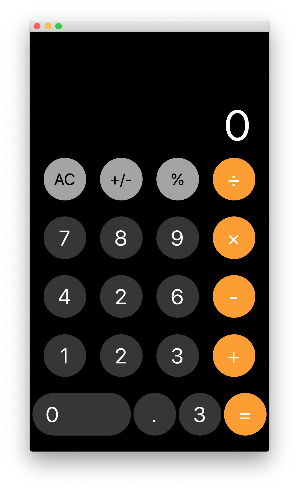

_Proton Native — React Native like environment on top of Qt for building desktop apps in JS https://proton-native.js.org/#/_

1. Install NPM deps `yarn`
2. Build in dev `yarn dev`
3. Run in dev `node out/main.js`
4. Build executable `yarn build`, read this https://proton-native.js.org/#/packaging?id=packaging

